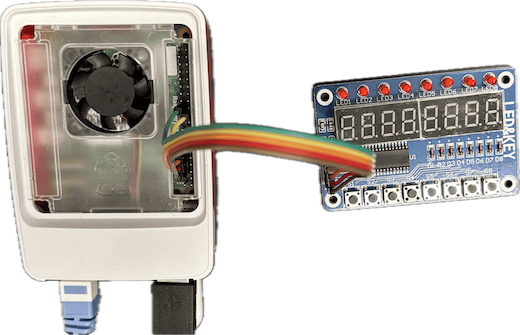

# pi-tm1638-lgpio

[English version / 英語版はこちら](README.md)

Martin Oldfield 氏の [pi-tm1638](https://github.com/mjoldfield/pi-tm1638) を、
bcm2835 の代わりに [lgpio](http://abyz.me.uk/lg/lgpio.html) を使うように移植したものです。
Raspberry Pi 5（RP1 チップ）および旧モデルでの動作をサポートします。

<figure align="center">
  
  <figcaption>Raspberry Pi5 and TM1638 board</figcaption>
</figure>

## 背景

オリジナルの pi-tm1638 ライブラリは GPIO アクセスに bcm2835 ライブラリを使用していますが、
Raspberry Pi 5 では新しい RP1 I/O チップのため bcm2835 が動作しません。
このポートでは bcm2835 を lgpio に置き換えることで、Pi 5 および旧モデルの両方に対応しています。

## 動作確認済み環境

| ハードウェア | OS | カーネル |
|---|---|---|
| Raspberry Pi 5 | Raspberry Pi OS Bookworm (Debian 12, 64bit) | 6.12.62 |
| Raspberry Pi 4 | Raspberry Pi OS Trixie (Debian 13, 64bit) | 6.12.47 |

## 依存ライブラリ
```bash
sudo apt install liblgpio-dev
```

## ビルド方法
```bash
git clone https://github.com/kuboaki/pi-tm1638-lgpio.git
cd pi-tm1638-lgpio
autoreconf -fi
./configure
make
sudo make install
```

## オリジナルからの変更点

- `src/tm1638.c`: bcm2835 API を lgpio API に置き換え
- `configure.ac`: 依存ライブラリを bcm2835 から lgpio に変更
- `src/Makefile.am`: CFLAGS（`-std=c99` → `-std=gnu99`）と LIBS を更新
- `examples/Makefile.am`: CFLAGS（`-std=c99` → `-std=gnu99`）を更新
- `examples/*.c`: `bcm2835_init()/close()` を削除、`delay()` を `nanosleep()` に置き換え

## オリジナル

- 作者: Martin Oldfield &lt;ex-tm1638@mjo.tc&gt;
- リポジトリ: https://github.com/mjoldfield/pi-tm1638

## ライセンス

GPL v2（オリジナルと同じ）
